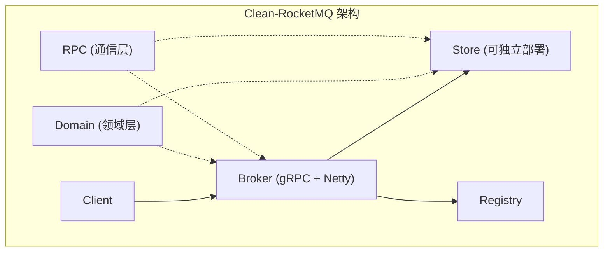
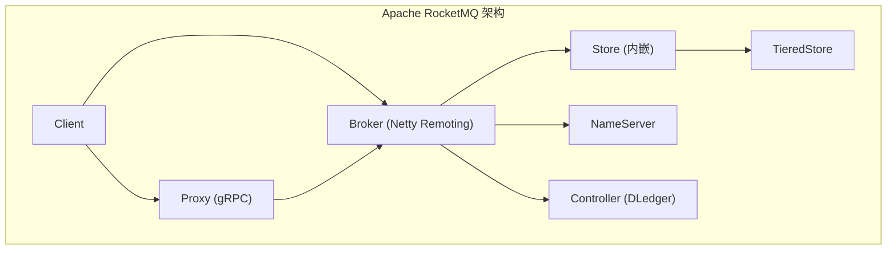
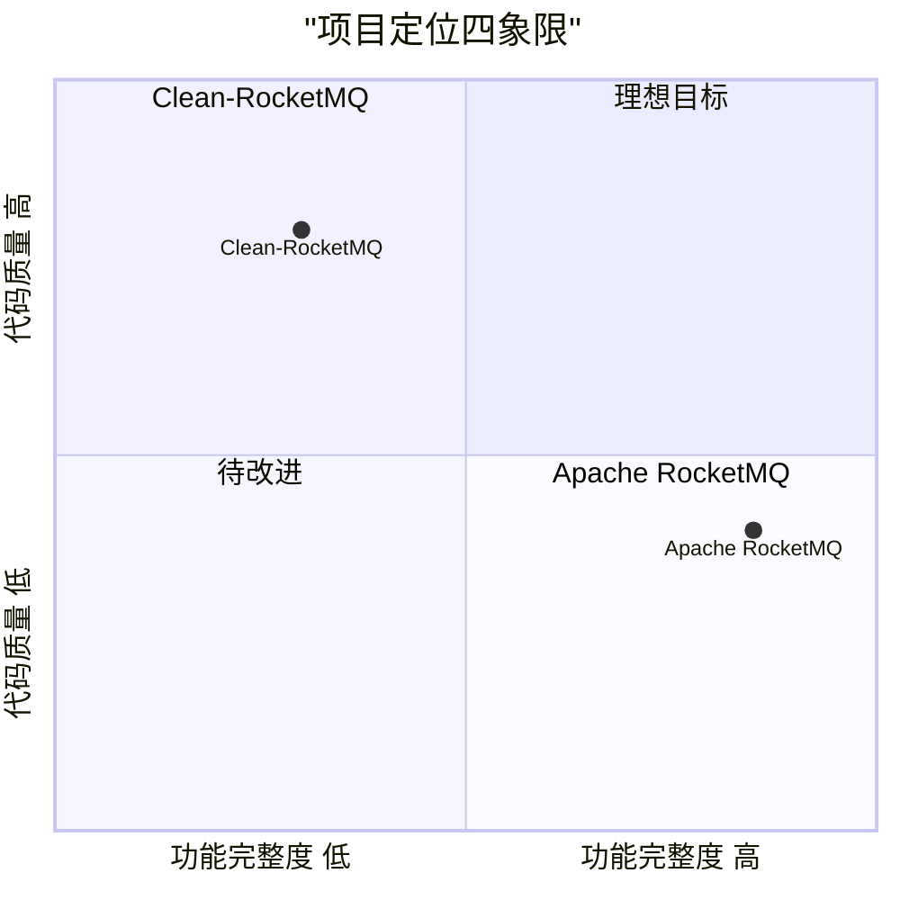

# Clean-RocketMQ vs Apache RocketMQ 对比报告

## 1. 项目概览

| 维度 | Clean-RocketMQ (WolfMQ) | Apache RocketMQ |
|---|---|---|
| **定位** | RocketMQ 的传承与优化，从零重写 | Apache 顶级项目，云原生消息流平台 |
| **主要语言** | Java | Java |
| **模块数** | 6 个核心模块 | 20+ 模块 |
| **源文件数** | ~989 文件 | 数千文件 |
| **代码行数(主代码)** | ~139K 行 | ~300K+ 行(核心 ~50K) |
| **测试文件数** | ~155 个测试文件 | 数百个测试文件 |
| **GitHub Stars** | 新项目 | 22.4K ⭐ |
| **生产验证** | 开发阶段 | 万亿级消息验证，阿里等大厂生产使用 |
| **协议** | Apache 2.0 | Apache 2.0 |

---

## 2. 架构对比

### 2.1 整体架构





### 2.2 模块结构对比

| Clean-RocketMQ 模块 | 文件/行数 | 对应 Apache RocketMQ 模块 |
|---|---|---|
| `domain` (领域模型) | 280 files / 18K lines | `common` (公共定义) |
| `broker` (消息代理) | 166 files / 16K lines | `broker` + `proxy` |
| `store` (存储引擎) | 143 files / 14K lines | `store` + `tieredstore` |
| `registry` (注册中心) | 33 files / 3.5K lines | `namesrv` |
| `rpc` (通信框架) | 323 files / 81K lines | `remoting` + `client` |
| — | — | `controller`, `auth`, `filter`, `container`, `tools` 等 |

> [!IMPORTANT]
> Clean-RocketMQ 的核心创新在于**独立的 `domain` 层**和**可分离部署的 `store` 层**，这是与原版最大的架构差异。

### 2.3 分层架构对比

**Clean-RocketMQ — DDD 分层 (以 Broker 为例)**：
```
broker/
├── api/                   # API 层 (Controller + Validator)
│   ├── ProducerController
│   ├── ConsumerController
│   ├── TransactionController
│   └── validator/
├── domain/                # 领域层 (核心业务逻辑)
│   ├── producer/          # 生产者领域
│   ├── consumer/          # 消费者领域 (pop/ack/renew/revive)
│   ├── transaction/       # 事务领域 (prepare/commit/rollback/check)
│   ├── timer/             # 定时消息领域
│   └── meta/              # 元数据领域
├── infra/                 # 基础设施层
│   ├── embed/             # 嵌入式 Store 适配
│   ├── remote/            # 远程 Store 适配
│   ├── store/             # Store 接口抽象
│   └── task/              # 任务调度
└── server/                # 服务器层
    ├── bootstrap/         # 启动引导
    ├── grpc/              # gRPC 服务
    └── core/              # 核心调度
```

**Apache RocketMQ — 传统分层**：
```
broker/
├── BrokerController       # 超大类，数千行，承载大量职责
├── processor/             # 请求处理器 (扁平结构)
├── topic/                 # Topic 管理
├── client/                # 客户端管理
├── offset/                # 偏移量管理
├── subscription/          # 订阅管理
├── transaction/           # 事务
├── schedule/              # 定时消息
└── ...                    # 其他功能模块平铺
```

> [!TIP]
> Clean-RocketMQ 采用 DDD 分层，职责边界清晰。原版 RocketMQ 的 `BrokerController` 是典型的 God Class，职责过于集中。

---

## 3. 核心实现对比

### 3.1 CommitLog — 最关键的存储差异

| 特性 | Clean-RocketMQ | Apache RocketMQ |
|---|---|---|
| **CommitLog 数量** | **多分片** (可配置 N 个) | **单个** CommitLog |
| **写入锁** | 每个分片独立锁 | 全局单锁 |
| **分片策略** | Topic Hash / Thread ID / Random | 不适用 |
| **Offset 编码** | `offset * maxShardingNumber + shardId` | 原始顺序 offset |
| **并发写入** | 多线程并行写不同分片 | 所有写操作串行 |
| **理论吞吐** | 5x+ 提升 (README 声称) | 受限于单 CommitLog 锁 |

**Clean-RocketMQ 的 CommitLog 分片机制**：

```java
// OffsetCodec — 分片 offset 编码
public long encode(long offset) {
    return offset * maxShardingNumber + shardId;  // 编码分片信息到 offset
}

// CommitLogManager — 多种分片选择策略
private CommitLog selectByMessage(MessageBO messageBO) {
    if (1 == commitLogArray.length) return commitLogArray[0];
    if (config.isBindShardingWithCpu()) return selectByThreadId();
    return selectByRandom();
}
```

> [!IMPORTANT]
> 这是 Clean-RocketMQ 最核心的性能创新。原版 RocketMQ 单 CommitLog 在高并发下成为瓶颈，分片方案可线性提升写入吞吐。但也引入了分片间消息顺序性、offset 编解码复杂度等挑战。

### 3.2 存算分离

| 特性 | Clean-RocketMQ | Apache RocketMQ |
|---|---|---|
| **Store 部署方式** | **嵌入式** 或 **独立进程 (RPC)** | 仅嵌入式 |
| **Store 通信** | Store 可通过 RPC Server 独立服务 | Broker 直接调用 Store API |
| **适配层** | `EmbedXxxStore` / `RemoteXxxStore` 双实现 | 无此抽象 |
| **分层存储** | 通过 Store 独立部署实现 | `tieredstore` 模块 |

```java
// Clean-RocketMQ 的 Store 双模式接口
broker/infra/embed/EmbedMQStore.java      // 嵌入式实现
broker/infra/remote/RemoteMQStore.java    // 远程 RPC 实现
broker/infra/store/MQStore.java           // 统一接口抽象
```

### 3.3 生命周期管理

**Clean-RocketMQ** — 统一 Lifecycle 接口 + ComponentRegister 模式：
```java
public class Broker implements Lifecycle {
    public void initialize() { componentManager.initialize(); }
    public void start()      { componentManager.start(); }
    public void shutdown()    { componentManager.shutdown(); }
}
// ComponentRegister 按 infra → domain → server 顺序注册
```

**Apache RocketMQ** — BrokerController 集中管理，手动编排启动顺序，缺乏统一生命周期抽象。

### 3.4 事务消息

| 特性 | Clean-RocketMQ | Apache RocketMQ |
|---|---|---|
| **架构** | Transaction 聚合根 + 细粒度 Service | EndTransactionProcessor + 扁平实现 |
| **流程拆分** | Prepare / Commit / Rollback / Check 各自独立 Service | 集中在少数几个大类中 |
| **回查** | CheckerFactory + CheckService + DiscardService | TransactionalMessageCheckService |
| **Receipt 管理** | ReceiptRegistry 独立管理事务凭证 | 耦合在 Broker 内部 |

### 3.5 消费者模型

Clean-RocketMQ 消费者领域拆分为 5 个子模块：
- `pop/` — Pop 消费服务 (BrokerDequeueService, PopService)
- `ack/` — 确认服务 (BrokerAckService, AckValidator)
- `renew/` — 续期/重置不可见时间 (RenewService, ReceiptHandler)
- `revive/` — 消息复活/重试 (Reviver, RetryService)
- `consumer/` — 消费者管理 (ConsumerManager, ConsumeHookManager)

Apache RocketMQ 将这些逻辑更多地集中在 `PopMessageProcessor`、`AckMessageProcessor` 等大型处理器中。

---

## 4. 功能对比

| 功能 | Clean-RocketMQ | Apache RocketMQ | 说明 |
|---|---|---|---|
| **Pub/Sub** | ✅ | ✅ | 基础功能 |
| **顺序消息** | ✅ | ✅ | 队列级有序 |
| **延时消息** | ✅ (TimerWheel + RocksDB) | ✅ (TimerWheel / 固定级别) | Clean 支持任意时间 |
| **事务消息** | ✅ | ✅ | 两阶段提交 |
| **消息过滤 (Tag/SQL)** | ✅ (Tag) | ✅ (Tag + SQL92) | Clean 暂缺 SQL 过滤 |
| **Pop 消费** | ✅ | ✅ | 服务端消费管理 |
| **消息回溯** | ✅ | ✅ | 按时间/offset 回溯 |
| **CommitLog 分片** | ✅ **独创** | ❌ | Clean 核心优势 |
| **存算分离** | ✅ (部分完成) | ✅ (TieredStore) | 方案不同 |
| **Raft 共识** | ❌ (规划中) | ✅ (DLedger) | Clean 暂缺 |
| **Controller 选主** | ❌ | ✅ (DLedger Controller) | |
| **多协议** | gRPC + Netty RPC | gRPC + Netty + MQTT + OpenMessaging | RocketMQ 更丰富 |
| **Auth 认证** | ❌ | ✅ (ACL + 独立 auth 模块) | |
| **管控台** | ❌ | ✅ (RocketMQ Dashboard) | |
| **运维工具** | ❌ | ✅ (mqadmin 等) | |
| **多语言 Client** | ❌ | ✅ (Java/Go/C++/Python/Node.js) | |
| **K8s Operator** | ❌ | ✅ | |
| **Connector 生态** | ❌ | ✅ (Flink/Streams/Connect) | |
| **消息轨迹** | ❌ | ✅ | |

> [!WARNING]
> Clean-RocketMQ 在**生态完整性**上与 Apache RocketMQ 差距较大。缺少认证、管控台、多语言客户端、运维工具等生产必需组件。

---

## 5. 代码质量对比

### 5.1 设计模式与原则

| 维度 | Clean-RocketMQ | Apache RocketMQ |
|---|---|---|
| **设计方法** | DDD (领域驱动设计) | 传统分层 |
| **类职责** | 单一职责，小类小方法 | 存在 God Class (BrokerController 数千行) |
| **依赖管理** | 接口抽象 + 依赖倒置 | 部分紧耦合 |
| **生命周期** | 统一 Lifecycle 接口 | 手动管理 |
| **命名规范** | 清晰的业务语义命名 | 偏技术实现命名 |
| **Bootstrap 模式** | 每个子域独立 Bootstrap | 集中在 Controller |

### 5.2 代码示例对比

**Broker 入口 — Clean-RocketMQ (108 行，职责清晰)**：
```java
public class Broker implements Lifecycle {
    public void start() {
        this.initialize();
        this.componentManager.start();
        addShutdownHook();
    }
}
```

**Broker 入口 — Apache RocketMQ (BrokerController 4000+ 行)**：
- 混合了配置加载、组件初始化、RPC 注册、定时任务、消息处理等所有逻辑
- 典型的 God Class 反模式

### 5.3 模块内聚度

Clean-RocketMQ 每个模块平均代码行数：

| 模块 | 文件数 | 行数 | 平均行/文件 |
|---|---|---|---|
| broker | 166 | 16,407 | ~99 |
| domain | 280 | 18,385 | ~66 |
| store | 143 | 14,122 | ~99 |
| registry | 33 | 3,573 | ~108 |
| rpc | 323 | 80,793 | ~250 |

> [!NOTE]
> `rpc` 模块行数较高(81K)，因为包含了大量协议定义和序列化代码。核心业务模块(`broker`、`store`、`domain`)保持了良好的小文件原则，平均每文件不超过 110 行。

---

## 6. 性能对比分析

### 6.1 理论性能分析

| 性能维度 | Clean-RocketMQ | Apache RocketMQ |
|---|---|---|
| **写入并发度** | N 个 CommitLog 分片并行写 | 单 CommitLog 串行写 |
| **锁竞争** | 分片级锁，竞争分散 | 全局锁，高并发瓶颈 |
| **CPU 亲和** | 支持 Thread-Shard 绑定 | 不支持 |
| **IO 分散** | 多文件并行 IO | 单文件顺序 IO |
| **顺序写优势** | 分片后仍为顺序写 | 单文件顺序写 |

**Clean-RocketMQ 的分片策略**：
1. **Random** — 随机选择分片，最大化分散
2. **BindShardingWithCPU** — 线程 ID 映射到分片，减少上下文切换
3. **Topic Hash** — 按 Topic 哈希分配（已注释，待完善）

### 6.2 潜在风险

| 风险 | 说明 |
|---|---|
| **顺序消息受限** | 分片后同一 Topic 消息可能分散到不同 CommitLog，影响全局有序性 |
| **Offset 编码复杂度** | `offset * maxShardingNumber + shardId` 增加了 offset 管理的复杂度 |
| **HA 复制复杂度** | 多分片的主从同步比单文件更复杂 |
| **缺少实际 Benchmark** | 尚无公开的对比性能测试数据 |

> [!CAUTION]
> Clean-RocketMQ 声称 5x+ 吞吐提升，但目前缺少公开的 Benchmark 数据验证。分片方案的实际收益受 IO 硬件（SSD vs HDD）、操作系统页缓存行为等因素影响较大。

---

## 7. 综合优劣势分析

### 7.1 Clean-RocketMQ 优势

| 优势 | 详细说明 |
|---|---|
| 🏗️ **架构更清晰** | DDD 分层设计，职责边界清晰，模块解耦度高 |
| ⚡ **CommitLog 分片** | 理论上可线性提升写入吞吐，突破单 CommitLog 锁瓶颈 |
| 🔌 **存算分离** | Store 可独立部署，为云原生铺路 |
| 📖 **可读性强** | 小类小方法，平均每文件 ~100 行，新人上手快 |
| 🔄 **生命周期统一** | Lifecycle 接口 + ComponentRegister，组件管理规范化 |
| 🧩 **扩展性好** | 接口抽象充分，Embed/Remote 双模式，策略模式广泛应用 |

### 7.2 Clean-RocketMQ 劣势

| 劣势 | 详细说明 |
|---|---|
| ❌ **未经生产验证** | 尚处于开发阶段，稳定性和可靠性未知 |
| ❌ **功能不完整** | 缺少 ACL、管控台、运维工具、多语言客户端 |
| ❌ **缺少 Raft** | 没有 DLedger/Raft 支持，无法自动选主 |
| ❌ **生态缺失** | 无 Connector、Streams、Operator 等生态组件 |
| ❌ **缺少 Benchmark** | 性能提升缺乏实际数据支撑 |
| ❌ **社区规模小** | 个人/小团队维护，长期可持续性存疑 |

### 7.3 Apache RocketMQ 优势

| 优势 | 详细说明 |
|---|---|
| ✅ **生产级成熟度** | 万亿级消息验证，阿里双十一等极端场景验证 |
| ✅ **功能完备** | 覆盖消息队列全场景需求 |
| ✅ **生态丰富** | 多语言客户端、K8s Operator、Dashboard 等 |
| ✅ **社区活跃** | 22K+ Stars, 500+ Contributors, Apache 基金会背书 |
| ✅ **HA 完善** | DLedger Controller 自动选主，多副本 |
| ✅ **协议支持多** | gRPC / Remoting / MQTT / OpenMessaging |

### 7.4 Apache RocketMQ 劣势

| 劣势 | 详细说明 |
|---|---|
| ⚠️ **代码可维护性差** | BrokerController 等 God Class，维护成本高 |
| ⚠️ **单 CommitLog 瓶颈** | 高并发写入受限于全局锁 |
| ⚠️ **架构耦合** | Broker 与 Store 紧耦合，难以独立演进 |
| ⚠️ **历史包袱重** | 兼容性考量限制了架构革新 |

---

## 8. 总结与建议

### 8.1 定位对比



### 8.2 适用场景

| 场景 | 推荐选择 | 原因 |
|---|---|---|
| **生产环境** | Apache RocketMQ | 成熟稳定，功能完备 |
| **学习 MQ 原理** | Clean-RocketMQ | 代码清晰，DDD 架构易理解 |
| **高并发写入优化研究** | Clean-RocketMQ | CommitLog 分片方案有参考价值 |
| **二次开发基础** | Clean-RocketMQ | 架构清晰，扩展性好 |
| **云原生部署** | Apache RocketMQ | 有 K8s Operator，TieredStore 支持 |

### 8.3 Clean-RocketMQ 发展建议

1. **优先完成 Benchmark**：用数据证明 CommitLog 分片的性能收益
2. **完善 HA**：实现 Raft 或 DLedger 支持，这是生产可用的前提
3. **补齐运维工具**：管控台、监控指标暴露、mqadmin 等
4. **协议兼容验证**：确保可以使用原版 RocketMQ 客户端连接
5. **发布 Benchmark 报告**：与 Apache RocketMQ 在相同硬件上做对比测试
