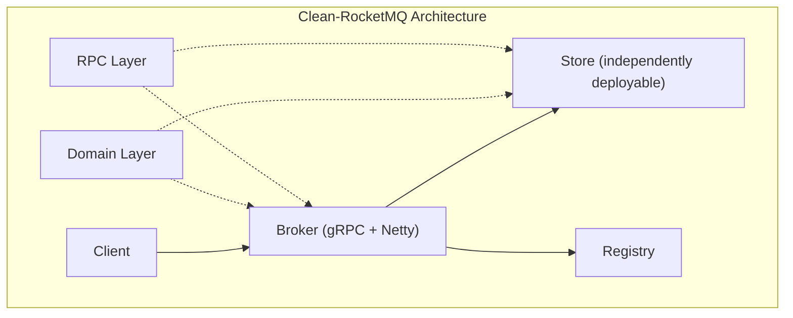
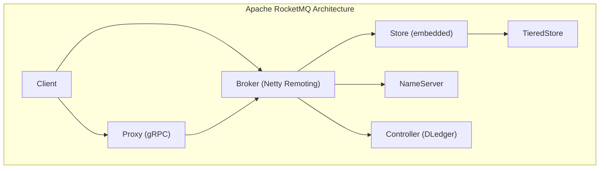
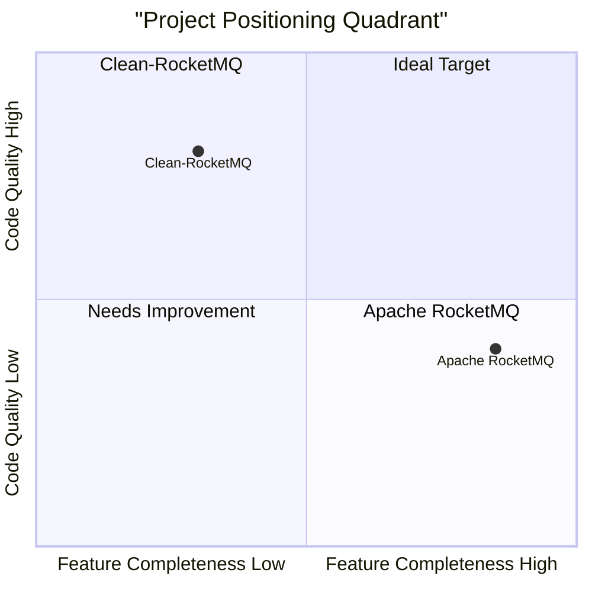

# Clean-RocketMQ vs Apache RocketMQ — Comparison Report

## 1. Project Overview

| Dimension | Clean-RocketMQ (WolfMQ) | Apache RocketMQ |
|---|---|---|
| **Positioning** | Rewrite & evolution of RocketMQ from scratch | Apache top-level project, cloud-native messaging platform |
| **Language** | Java | Java |
| **Module Count** | 6 core modules | 20+ modules |
| **Source Files** | ~989 files | Thousands of files |
| **Lines of Code (main)** | ~139K lines | ~300K+ lines (core ~50K) |
| **Test Files** | ~155 test files | Hundreds of test files |
| **GitHub Stars** | New project | 22.4K ⭐ |
| **Production Proven** | In development | Trillion-level message throughput, used by Alibaba & others |
| **License** | Apache 2.0 | Apache 2.0 |

---

## 2. Architecture Comparison

### 2.1 High-Level Architecture





### 2.2 Module Structure Comparison

| Clean-RocketMQ Module | Files / Lines | Corresponding Apache RocketMQ Module |
|---|---|---|
| `domain` (domain model) | 280 files / 18K lines | `common` (shared definitions) |
| `broker` (message broker) | 166 files / 16K lines | `broker` + `proxy` |
| `store` (storage engine) | 143 files / 14K lines | `store` + `tieredstore` |
| `registry` (service registry) | 33 files / 3.5K lines | `namesrv` |
| `rpc` (communication framework) | 323 files / 81K lines | `remoting` + `client` |
| — | — | `controller`, `auth`, `filter`, `container`, `tools`, etc. |

> [!IMPORTANT]
> Clean-RocketMQ's core innovation lies in the **independent `domain` layer** and the **separately deployable `store` layer** — the most significant architectural differences from the original.

### 2.3 Layered Architecture Comparison

**Clean-RocketMQ — DDD Layering (Broker example)**:
```
broker/
├── api/                   # API Layer (Controller + Validator)
│   ├── ProducerController
│   ├── ConsumerController
│   ├── TransactionController
│   └── validator/
├── domain/                # Domain Layer (core business logic)
│   ├── producer/          # Producer domain
│   ├── consumer/          # Consumer domain (pop/ack/renew/revive)
│   ├── transaction/       # Transaction domain (prepare/commit/rollback/check)
│   ├── timer/             # Scheduled message domain
│   └── meta/              # Metadata domain
├── infra/                 # Infrastructure Layer
│   ├── embed/             # Embedded Store adapter
│   ├── remote/            # Remote Store adapter
│   ├── store/             # Store interface abstraction
│   └── task/              # Task scheduling
└── server/                # Server Layer
    ├── bootstrap/         # Bootstrap orchestration
    ├── grpc/              # gRPC service
    └── core/              # Core scheduling
```

**Apache RocketMQ — Traditional Layering**:
```
broker/
├── BrokerController       # God class, thousands of lines, too many responsibilities
├── processor/             # Request processors (flat structure)
├── topic/                 # Topic management
├── client/                # Client management
├── offset/                # Offset management
├── subscription/          # Subscription management
├── transaction/           # Transaction
├── schedule/              # Scheduled messages
└── ...                    # Other feature modules laid out flat
```

> [!TIP]
> Clean-RocketMQ adopts DDD layering with clear responsibility boundaries. Apache RocketMQ's `BrokerController` is a classic God Class anti-pattern with overly concentrated responsibilities.

---

## 3. Core Implementation Comparison

### 3.1 CommitLog — The Most Critical Storage Difference

| Feature | Clean-RocketMQ | Apache RocketMQ |
|---|---|---|
| **CommitLog Count** | **Multi-shard** (configurable N shards) | **Single** CommitLog |
| **Write Lock** | Independent lock per shard | Global single lock |
| **Sharding Strategy** | Topic Hash / Thread ID / Random | N/A |
| **Offset Encoding** | `offset * maxShardingNumber + shardId` | Raw sequential offset |
| **Concurrent Writes** | Multi-threaded parallel writes to different shards | All writes serialized |
| **Theoretical Throughput** | 5x+ improvement (as claimed) | Limited by single CommitLog lock |

**Clean-RocketMQ CommitLog Sharding Mechanism**:

```java
// OffsetCodec — Shard-aware offset encoding
public long encode(long offset) {
    return offset * maxShardingNumber + shardId;  // Encodes shard info into offset
}

// CommitLogManager — Multiple shard selection strategies
private CommitLog selectByMessage(MessageBO messageBO) {
    if (1 == commitLogArray.length) return commitLogArray[0];
    if (config.isBindShardingWithCpu()) return selectByThreadId();
    return selectByRandom();
}
```

> [!IMPORTANT]
> This is Clean-RocketMQ's most significant performance innovation. The original RocketMQ's single CommitLog becomes a bottleneck under high concurrency; the sharding approach can linearly scale write throughput. However, it also introduces challenges around cross-shard message ordering and offset encoding/decoding complexity.

### 3.2 Compute-Storage Separation

| Feature | Clean-RocketMQ | Apache RocketMQ |
|---|---|---|
| **Store Deployment** | **Embedded** or **Standalone process (RPC)** | Embedded only |
| **Store Communication** | Store can serve independently via RPC Server | Broker calls Store API directly |
| **Adapter Layer** | Dual implementations: `EmbedXxxStore` / `RemoteXxxStore` | No such abstraction |
| **Tiered Storage** | Achieved via standalone Store deployment | Dedicated `tieredstore` module |

```java
// Clean-RocketMQ dual-mode Store interfaces
broker/infra/embed/EmbedMQStore.java      // Embedded implementation
broker/infra/remote/RemoteMQStore.java    // Remote RPC implementation
broker/infra/store/MQStore.java           // Unified interface abstraction
```

### 3.3 Lifecycle Management

**Clean-RocketMQ** — Unified Lifecycle interface + ComponentRegister pattern:
```java
public class Broker implements Lifecycle {
    public void initialize() { componentManager.initialize(); }
    public void start()      { componentManager.start(); }
    public void shutdown()    { componentManager.shutdown(); }
}
// ComponentRegister registers components in order: infra → domain → server
```

**Apache RocketMQ** — BrokerController manages everything centrally with manually orchestrated startup sequences and no unified lifecycle abstraction.

### 3.4 Transactional Messages

| Feature | Clean-RocketMQ | Apache RocketMQ |
|---|---|---|
| **Architecture** | Transaction aggregate root + fine-grained Services | EndTransactionProcessor + flat implementation |
| **Flow Separation** | Independent Services for Prepare / Commit / Rollback / Check | Concentrated in a few large classes |
| **Check-back** | CheckerFactory + CheckService + DiscardService | TransactionalMessageCheckService |
| **Receipt Mgmt** | ReceiptRegistry manages transaction receipts independently | Coupled within Broker internals |

### 3.5 Consumer Model

Clean-RocketMQ's consumer domain is split into 5 sub-modules:
- `pop/` — Pop consumption service (BrokerDequeueService, PopService)
- `ack/` — Acknowledgment service (BrokerAckService, AckValidator)
- `renew/` — Visibility timeout renewal (RenewService, ReceiptHandler)
- `revive/` — Message revival / retry (Reviver, RetryService)
- `consumer/` — Consumer management (ConsumerManager, ConsumeHookManager)

Apache RocketMQ concentrates these concerns in large processors such as `PopMessageProcessor` and `AckMessageProcessor`.

---

## 4. Feature Comparison

| Feature | Clean-RocketMQ | Apache RocketMQ | Notes |
|---|---|---|---|
| **Pub/Sub** | ✅ | ✅ | Core feature |
| **Ordered Messages** | ✅ | ✅ | Queue-level ordering |
| **Delayed Messages** | ✅ (TimerWheel + RocksDB) | ✅ (TimerWheel / fixed levels) | Clean supports arbitrary delays |
| **Transactional Messages** | ✅ | ✅ | Two-phase commit |
| **Message Filtering (Tag/SQL)** | ✅ (Tag only) | ✅ (Tag + SQL92) | Clean lacks SQL filtering |
| **Pop Consumption** | ✅ | ✅ | Server-side consumption mgmt |
| **Message Replay** | ✅ | ✅ | By time or offset |
| **CommitLog Sharding** | ✅ **Unique** | ❌ | Clean's core advantage |
| **Compute-Storage Separation** | ✅ (partially complete) | ✅ (TieredStore) | Different approaches |
| **Raft Consensus** | ❌ (planned) | ✅ (DLedger) | Clean lacks this |
| **Controller Leader Election** | ❌ | ✅ (DLedger Controller) | |
| **Multi-Protocol** | gRPC + Netty RPC | gRPC + Netty + MQTT + OpenMessaging | RocketMQ richer |
| **Authentication** | ❌ | ✅ (ACL + dedicated auth module) | |
| **Dashboard** | ❌ | ✅ (RocketMQ Dashboard) | |
| **Operations Tools** | ❌ | ✅ (mqadmin, etc.) | |
| **Multi-Language Clients** | ❌ | ✅ (Java/Go/C++/Python/Node.js) | |
| **K8s Operator** | ❌ | ✅ | |
| **Connector Ecosystem** | ❌ | ✅ (Flink/Streams/Connect) | |
| **Message Tracing** | ❌ | ✅ | |

> [!WARNING]
> Clean-RocketMQ has a significant gap in **ecosystem completeness** compared to Apache RocketMQ. It lacks authentication, dashboard, multi-language clients, operations tools, and other production-critical components.

---

## 5. Code Quality Comparison

### 5.1 Design Patterns & Principles

| Dimension | Clean-RocketMQ | Apache RocketMQ |
|---|---|---|
| **Design Approach** | DDD (Domain-Driven Design) | Traditional layering |
| **Class Responsibilities** | Single Responsibility, small classes & methods | God Classes exist (BrokerController: thousands of lines) |
| **Dependency Mgmt** | Interface abstraction + Dependency Inversion | Some tight coupling |
| **Lifecycle** | Unified Lifecycle interface | Manual management |
| **Naming Conventions** | Clear business-semantic naming | Implementation-oriented naming |
| **Bootstrap Pattern** | Independent Bootstrap per sub-domain | Centralized in Controller |

### 5.2 Code Examples

**Broker Entry — Clean-RocketMQ (108 lines, clear responsibilities)**:
```java
public class Broker implements Lifecycle {
    public void start() {
        this.initialize();
        this.componentManager.start();
        addShutdownHook();
    }
}
```

**Broker Entry — Apache RocketMQ (BrokerController: 4000+ lines)**:
- Mixes config loading, component initialization, RPC registration, scheduled tasks, message processing, and more
- Classic God Class anti-pattern

### 5.3 Module Cohesion

Clean-RocketMQ average lines per file by module:

| Module | Files | Lines | Avg Lines/File |
|---|---|---|---|
| broker | 166 | 16,407 | ~99 |
| domain | 280 | 18,385 | ~66 |
| store | 143 | 14,122 | ~99 |
| registry | 33 | 3,573 | ~108 |
| rpc | 323 | 80,793 | ~250 |

> [!NOTE]
> The `rpc` module has a higher line count (81K) because it contains extensive protocol definitions and serialization code. Core business modules (`broker`, `store`, `domain`) maintain a good small-file principle, averaging no more than 110 lines per file.

---

## 6. Performance Analysis

### 6.1 Theoretical Performance

| Dimension | Clean-RocketMQ | Apache RocketMQ |
|---|---|---|
| **Write Concurrency** | N CommitLog shards write in parallel | Single CommitLog serialized writes |
| **Lock Contention** | Shard-level locks, contention distributed | Global lock, high-concurrency bottleneck |
| **CPU Affinity** | Supports Thread-to-Shard binding | Not supported |
| **IO Distribution** | Parallel IO across multiple files | Single-file sequential IO |
| **Sequential Write** | Each shard still writes sequentially | Single-file sequential write |

**Clean-RocketMQ Sharding Strategies**:
1. **Random** — Randomly select a shard for maximum distribution
2. **BindShardingWithCPU** — Map thread ID to shard, reducing context switches
3. **Topic Hash** — Assign by topic hash (commented out, pending refinement)

### 6.2 Potential Risks

| Risk | Description |
|---|---|
| **Ordered Messages Impacted** | Messages from the same topic may scatter across shards, breaking global ordering |
| **Offset Encoding Complexity** | `offset * maxShardingNumber + shardId` adds complexity to offset management |
| **HA Replication Complexity** | Multi-shard master-slave sync is more complex than single-file replication |
| **No Published Benchmarks** | No publicly available comparative performance test data yet |

> [!CAUTION]
> Clean-RocketMQ claims 5x+ throughput improvement, but currently lacks published benchmark data for verification. The actual gain from sharding depends heavily on IO hardware (SSD vs HDD), OS page cache behavior, and workload characteristics.

---

## 7. Comprehensive Strengths & Weaknesses

### 7.1 Clean-RocketMQ Strengths

| Strength | Details |
|---|---|
| 🏗️ **Cleaner Architecture** | DDD layering, clear responsibility boundaries, high module decoupling |
| ⚡ **CommitLog Sharding** | Theoretically scales write throughput linearly, breaking the single CommitLog lock bottleneck |
| 🔌 **Compute-Storage Separation** | Store can be deployed independently, paving the way for cloud-native |
| 📖 **High Readability** | Small classes & methods, ~100 lines per file average, easy onboarding |
| 🔄 **Unified Lifecycle** | Lifecycle interface + ComponentRegister normalizes component management |
| 🧩 **Good Extensibility** | Thorough interface abstractions, Embed/Remote dual mode, Strategy pattern widely used |

### 7.2 Clean-RocketMQ Weaknesses

| Weakness | Details |
|---|---|
| ❌ **Not Production Proven** | Still in development; stability and reliability unknown |
| ❌ **Incomplete Features** | Missing ACL, dashboard, operations tools, multi-language clients |
| ❌ **No Raft Support** | No DLedger/Raft, cannot perform automatic leader election |
| ❌ **Missing Ecosystem** | No Connectors, Streams, Operator, or other ecosystem components |
| ❌ **No Benchmarks** | Performance claims lack empirical data |
| ❌ **Small Community** | Maintained by individual/small team; long-term sustainability uncertain |

### 7.3 Apache RocketMQ Strengths

| Strength | Details |
|---|---|
| ✅ **Production-Grade Maturity** | Proven at trillion-level message throughput, battle-tested in Alibaba Double-11 |
| ✅ **Feature Complete** | Covers all messaging scenarios |
| ✅ **Rich Ecosystem** | Multi-language clients, K8s Operator, Dashboard, etc. |
| ✅ **Active Community** | 22K+ Stars, 500+ Contributors, Apache Foundation backing |
| ✅ **Robust HA** | DLedger Controller auto leader election, multi-replica |
| ✅ **Multi-Protocol** | gRPC / Remoting / MQTT / OpenMessaging |

### 7.4 Apache RocketMQ Weaknesses

| Weakness | Details |
|---|---|
| ⚠️ **Poor Code Maintainability** | God Classes like BrokerController, high maintenance cost |
| ⚠️ **Single CommitLog Bottleneck** | High-concurrency writes limited by global lock |
| ⚠️ **Architectural Coupling** | Broker and Store tightly coupled, hard to evolve independently |
| ⚠️ **Legacy Burden** | Backward compatibility constraints limit architectural innovation |

---

## 8. Conclusion & Recommendations

### 8.1 Positioning



### 8.2 Recommended Use Cases

| Scenario | Recommended | Reason |
|---|---|---|
| **Production Environment** | Apache RocketMQ | Mature, stable, feature-complete |
| **Learning MQ Internals** | Clean-RocketMQ | Clear code, DDD architecture easy to understand |
| **High-Throughput Write Optimization Research** | Clean-RocketMQ | CommitLog sharding approach has reference value |
| **Secondary Development Base** | Clean-RocketMQ | Clean architecture, good extensibility |
| **Cloud-Native Deployment** | Apache RocketMQ | Has K8s Operator, TieredStore support |

### 8.3 Recommendations for Clean-RocketMQ

1. **Prioritize Benchmarks**: Prove CommitLog sharding performance gains with data
2. **Complete HA**: Implement Raft or DLedger support — a prerequisite for production readiness
3. **Add Operations Tools**: Dashboard, metrics exposure, mqadmin equivalents
4. **Protocol Compatibility Verification**: Ensure original RocketMQ clients can connect
5. **Publish Benchmark Reports**: Comparative testing against Apache RocketMQ on identical hardware
